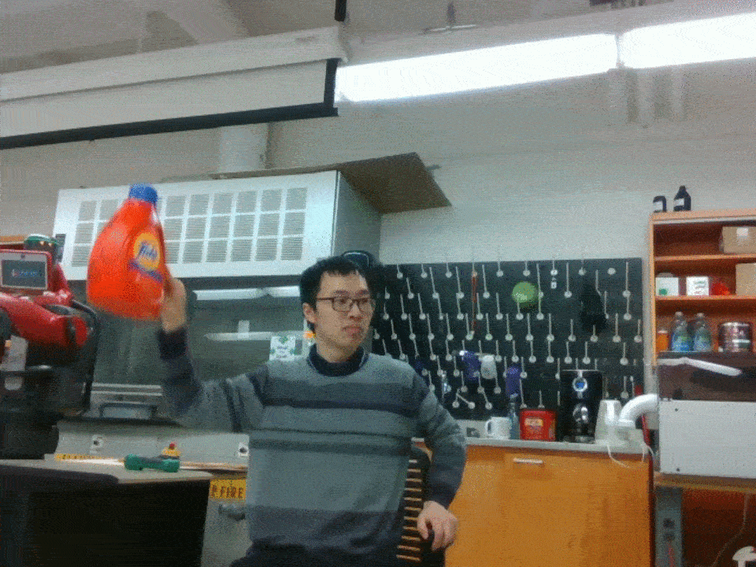
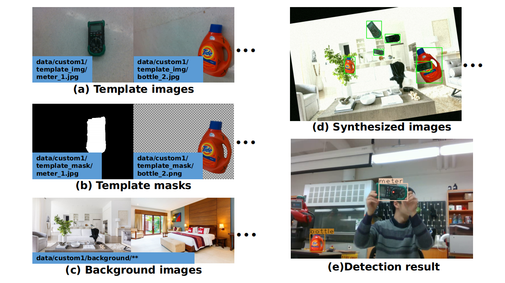

# Yolo as Template Matching

# 1. Introduction
**Abstract:**  
Run 3 simple scripts to synthesize images (by putting your template images onto backgrounds), train yolo, and achieve template matching.


**Features:**  
1. Detect objects whose appearance doesn't change much.
2. Save time from the boring labeling of training data. All you need is several *template images*, their *masks*, and some *background images*.   
3. Synthesize training images by putting the templates onto different backgrounds.
4. All setups for Yolo are automatically done.
5. This repo will be very helpful if you have a *robot arm* and a *depth camera* to automatically mask the object for you, like [this](https://github.com/felixchenfy/Mask-Objects-from-RGBD).
6. Good for robotics-related project involving object detection.


**Reference**:  
The core code of Yolo is copied from [this repo](https://github.com/eriklindernoren/PyTorch-YOLOv3), and is stored in [src/PyTorch_YOLOv3](src/PyTorch_YOLOv3). I modified its frontend code to meet my need.

**Demo:**  
The raw training data for this demo are:    
(1) 4 template images.  
(2) 25 background images downloaded directly from google.  
The parameters are set in [config/config.yaml](config/config.yaml). The details will be illustrated below.

<p align = "center">
  
  
</p>



# 2. How to run

## 2.0 Weights and Dependencies 
1. Download weights. See [weights/README.md](weights/README.md).
2. Install dependencies. See here: [doc/dependencies.md](doc/dependencies.md).


## 2.1 All commands ready to run

I've prepared the examplar images, settings and codes.  
You can directly run either one of the following commands:

```
source s1_main_setup.sh             # synthesize images and set up yolo files
source s3_inference_images.sh       # detecting objects from webcam, folder, or video.
source s4_inference_one_image.sh    # detecting objects from an image
```

After synthesizing images and setting yolo by running "source s1_main_setup.sh",  
you can run:
```
source s2_train.sh                  # train yolo
```

For more details, please read the following instructions.

## 2.2 Prepare data

### 2.2.1 Config
In [config/config.yaml](config/config.yaml), set the "data_name" and "data_labels" to yours.
```
data_name: "custom1" # Your data folder will be "data/custom1/"
data_labels: ["bottle", "meter"] # class names of the target objects
```

Set the "template_aug_effects" to meet your need.  
The other settings are also illustrated in that yaml file.

### 2.2.2 Folders
Create a folder "data/$data_name/", such as "data/custom1/". Create the following subfolders:
```
data/custom1
├── background
├── template_img
└── template_mask
```

### 2.2.3 template_img
Put your template images into [data/custom1/template_img/](data/custom1/template_img/) with a name of "name_index" and suffix of ".jpg" or ".png".  
```
template_img/
├── bottle_1.jpg
├── bottle_2.jpg
├── meter_1.jpg
└── meter_2.jpg
```
For example, [meter_1.jpg](data/custom1/template_img/meter_1.jpg) as shown in figure (a) below.  


### 2.2.4 template_mask
Copy the above images to [data/custom1/template_mask/](data/custom1/template_mask/). Use image editing tool to mask them as shown in figure (b) above.

Format 1: Color/Gray image, where white is the object.  
Format 2: Image with transparency channel (a 4-channel image). The non-transparent region is the object.
```
template_mask/
├── bottle_1.png
├── bottle_2.png
├── meter_1.jpg
└── meter_2.png
```
### 2.2.5 background

I downloaded 25 images from google by using [googleimagesdownload](https://github.com/hardikvasa/google-images-download) and the command:
> $ googleimagesdownload --keywords "room images" --limit 25

Copy these background images into [data/custom1/template_mask/](data/custom1/background/)

It'll be better to add the background images of your own scenes, which increases the detection precision.

## 2.3 Synthesize images and setup yolo

Run:  
> $ source s1_main_setup.sh
```
#!/bin/bash
python main_setup.py                \
    --verify_mask           True    \
    --augment_imgs          True    \
    --setup_train_test_txt  True    \
    --setup_yolo            True    
```

This will create the following things:
```
data/custom1_generated/
├── classes.names   # yolo
├── images/         # yolo
├── images_with_bbox/       # for your verification
├── labels/         # yolo
├── masked_template/        # for your verification
├── train.txt       # yolo
├── valid_images/           # copied images for you to test
├── valid.txt       # yolo
├── yolo.cfg        # yolo
└── yolo.data       # yolo
```

If you want to add your labeled data, you can put your data into the "images/" and "labels/" folder (with the yolo format), and then update the yolo files:

> $ python main_setup.py --setup_yolo True

## 2.4 Train Yolo

> $ source s2_train.sh
```
python src/train.py \
    --epochs 100 \
    --learning_rate 0.001 \
    --checkpoint_interval 10 \
    --pretrained_weights weights/darknet53.conv.74 \
    --batch_size 4 
```
The weights are saved to the [checkpoints/](checkpoints) folder.

## 2.5 Test Detection

### 2.5.1 Detecting multiple images
For detecting from (1) webcam, (2) folder, or (3) video,  
please see [s3_inference_images.sh](s3_inference_images.sh).

Select one of the "data_source" and "image_data_path", and then run:  
> $ source s3_inference_images.sh  

The result is saved to [output/](output/) folder.

A snippet of code is shown below: 
``` 
python src/detect_images.py \
    --weights_path "weights/yolo_trained.pth" \
    --conf_thres 0.9 \
    --nms_thres 0.3 \
    --batch_size 1 \
    --data_source $data_source \
    --image_data_path $image_data_path
```

### 2.5.2 Detecting one image
For detecting from an image, please modify the **image_filename** in [s4_inference_one_image.sh](s4_inference_one_image.sh), and then run:  
> $ source s4_inference_one_image.sh  

# 3. Reference
https://github.com/eriklindernoren/PyTorch-YOLOv3
